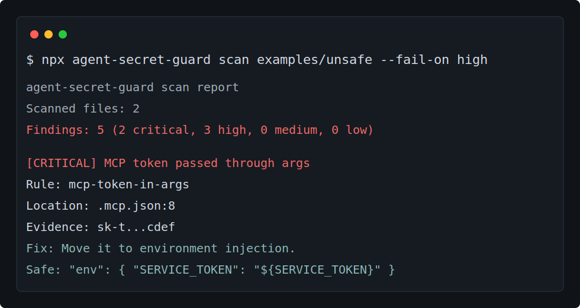

# agent-secret-guard

Read this in your language: English | [简体中文](README.zh-CN.md) | [繁體中文](README.zh-TW.md) | [日本語](README.ja.md) | [한국어](README.ko.md) | [Español](README.es.md) | [Français](README.fr.md) | [Deutsch](README.de.md) | [Português](README.pt.md) | [Русский](README.ru.md) | [العربية](README.ar.md) | [हिन्दी](README.hi.md) | [Bahasa Indonesia](README.id.md)

Dangerous config and secret scanner for AI coding agents, MCP, and local automation projects.

[](https://www.npmjs.com/package/agent-secret-guard)
[](https://github.com/aolingge/agent-secret-guard/actions/workflows/ci.yml)
[](https://github.com/aolingge/agent-secret-guard/actions/workflows/security.yml)
[](LICENSE)



`agent-secret-guard` is a 5-minute safety check for agent-era repos. It looks for the places normal secret scanners often miss: MCP command args, AI coding rules, local automation notes, browser profile paths, credential store references, and over-permissive GitHub Actions workflows.

Use it before you publish an AI agent, share a local automation repo, or ask a coding agent to work inside a project with real credentials nearby.

## Why This Exists

AI coding agents and MCP servers make local automation faster, but they also move secrets into new places:

- MCP configs can pass tokens through `args`, where they can leak into process listings and logs.
- Agent instruction files can contain copied shell commands, broad filesystem paths, or private setup notes.
- Browser profiles and credential stores can unlock sessions far outside the repo.
- GitHub Actions can accidentally give package-publishing jobs broad write access.

`agent-secret-guard` turns those patterns into concrete findings with a short explanation and a safer replacement.

## Quick Start

```bash
npx agent-secret-guard scan
```

Fail CI when high or critical findings are present:

```bash
npx agent-secret-guard scan . --fail-on high
```

Print machine-readable output:

```bash
npx agent-secret-guard scan . --format json
```

Generate SARIF for GitHub Code Scanning:

```bash
npx agent-secret-guard scan . --format sarif --output agent-secret-guard.sarif --fail-on high
```

Typical text output:

```text
HIGH mcp-token-in-args .mcp.json:6
MCP args include --token. Move the value to an environment variable or secret store.
```

## What It Catches

| Risk | Why it matters |
| --- | --- |
| MCP tokens in `args` | Command-line args can leak through process listings, logs, shell history, and agent transcripts. |
| Hardcoded API keys and package tokens | Agent context, commits, package tarballs, and logs can spread the value further. |
| Broad filesystem roots | Giving an agent `/`, `C:\`, `/Users`, or `C:\Users` makes accidental data exposure more likely. |
| Dangerous shell commands | Agents may run copied setup commands without human-level caution. |
| Browser profile exposure | Personal profiles can contain cookies, sessions, history, and autofill data. |
| Credential store exposure | Local token stores can unlock services far outside the project. |
| GitHub Actions over-permission | Broad workflow tokens can turn a compromised build step into write access. |

## Example

Unsafe MCP config:

```json
{
  "mcpServers": {
    "demo": {
      "command": "npx",
      "args": ["demo-mcp", "--token", "<real-service-token>"]
    }
  }
}
```

Safer config:

```json
{
  "mcpServers": {
    "demo": {
      "command": "npx",
      "args": ["demo-mcp"],
      "env": {
        "DEMO_API_KEY": "${DEMO_API_KEY}"
      }
    }
  }
}
```

## GitHub Action

Create `.github/workflows/agent-secret-guard.yml`:

```yaml
name: Agent Secret Guard

on:
  pull_request:
  push:
    branches: [main]

jobs:
  scan:
    runs-on: ubuntu-latest
    steps:
      - uses: actions/checkout@v4
      - uses: aolingge/agent-secret-guard@v0.2.3
        with:
          fail-on: high
```

To upload findings to GitHub Code Scanning:

```yaml
name: Agent Secret Guard

on:
  pull_request:
  push:
    branches: [main]

permissions:
  contents: read
  security-events: write

jobs:
  scan:
    runs-on: ubuntu-latest
    steps:
      - uses: actions/checkout@v4
      - uses: aolingge/agent-secret-guard@v0.2.3
        with:
          fail-on: high
          format: sarif
          output: agent-secret-guard.sarif
      - uses: github/codeql-action/upload-sarif@v3
        if: always()
        with:
          sarif_file: agent-secret-guard.sarif
```

## Pre-commit

Install [pre-commit](https://pre-commit.com/) and add this to `.pre-commit-config.yaml`:

```yaml
repos:
  - repo: https://github.com/aolingge/agent-secret-guard
    rev: v0.2.3
    hooks:
      - id: agent-secret-guard
```

Then run:

```bash
pre-commit install
```

## Files Scanned

By default, the CLI scans:

- `.env`, `.env.*`
- `.mcp.json`, `mcp.json`, `settings.json`
- `.cursor/mcp.json`, `.vscode/mcp.json`, `.claude/settings.json`, `.codex/config.toml`
- `.npmrc`, `.pypirc`
- `.cursorrules`, `.windsurfrules`, `.cursor/rules/*.mdc`
- `AGENTS.md`, `CLAUDE.md`, `GEMINI.md`, `CODEX.md`, `README.md`
- `docker-compose.yml`, `docker-compose.yaml`
- `.github/workflows/*.yml`, `.github/workflows/*.yaml`

It skips common generated folders such as `.git`, `node_modules`, `dist`, `coverage`, `.next`, `.turbo`, and `.cache`.

## Configuration

Create `.agent-secret-guard.json` to exclude known fixtures or generated examples:

```json
{
  "exclude": ["examples/unsafe/**"]
}
```

You can also pass exclusions at runtime:

```bash
npx agent-secret-guard scan . --exclude examples/unsafe/**
```

## How It Compares

`agent-secret-guard` is not a replacement for GitHub Secret Scanning, GitGuardian, gitleaks, or TruffleHog. Use those too.

This tool focuses on agent-specific configuration risks that are easy to miss in normal secret scanning: MCP command args, browser profile exposure, credential store paths, broad filesystem roots, and dangerous automation instructions.

See [docs/comparison.md](docs/comparison.md) for a practical comparison with other scanners.

## Privacy Model

The CLI scans local files and prints local reports. It does not call a remote service, upload findings, or verify credentials against providers. Findings are redacted where possible, but SARIF/JSON/text reports may still contain private file paths and surrounding evidence, so treat reports as sensitive artifacts.

See [docs/privacy.md](docs/privacy.md) for the full data-handling note.

## Fix Guide

Found something? Start with [docs/remediation.md](docs/remediation.md). It explains how to rotate exposed tokens, move MCP secrets into environment variables, narrow filesystem access, and harden GitHub Actions permissions.

## Development

```bash
npm install
npm test
npm run build
npm run lint
```

Run the local build:

```bash
npm run build
node dist/cli.js scan examples/unsafe --fail-on high
```

## Publishing

Future npm releases are designed to run through GitHub Actions Trusted Publishing, so maintainers do not need to keep entering local npm 2FA prompts. See [docs/publishing.md](docs/publishing.md).

Maintainers can use [docs/launch-kit.md](docs/launch-kit.md) for release notes, X/LinkedIn/Reddit copy, and a short demo script. Chinese launch copy is available in [docs/launch-kit.zh-CN.md](docs/launch-kit.zh-CN.md).

## Roadmap

- More MCP client formats and schema-aware checks.
- Rule suppression with inline justification.
- A small website with before/after examples.
- More language packs for report text.

## Security

This tool reports suspicious values and tries to redact secret evidence. Do not paste full scan output into public issues if it contains private paths or unredacted material. See [SECURITY.md](SECURITY.md).

## License

MIT
